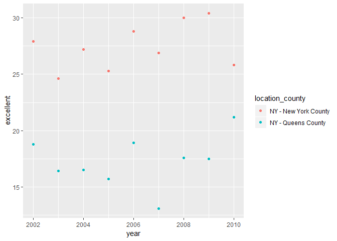

p8105\_hw2\_baw2160
================
Bryce Wong
September 28, 2018

Problem One:
------------

### Read and clean the data:

-   Read in csv file and adjusting the variable names to lowercase snakecase.
-   Retained line, station name, station latitude / longitude, routes served, entry, vending, entrance type, and ADA compliance.
-   Converted the entry variable from character (YES vs NO) to a logical variable.

``` r
options(tibble.print_min = 3)

NYC_transit_data = read_csv(file = "./data/NYC_Transit_Subway_Entrance_And_Exit_Data.csv") %>% 
  janitor::clean_names() %>% 
  select(line, station_name, station_latitude, station_longitude, route1:route11, entry, vending, entrance_type, ada) %>% 
  mutate(entry = recode(entry, "YES" = TRUE, "NO" = FALSE))
```

    ## Parsed with column specification:
    ## cols(
    ##   .default = col_character(),
    ##   `Station Latitude` = col_double(),
    ##   `Station Longitude` = col_double(),
    ##   Route8 = col_integer(),
    ##   Route9 = col_integer(),
    ##   Route10 = col_integer(),
    ##   Route11 = col_integer(),
    ##   ADA = col_logical(),
    ##   `Free Crossover` = col_logical(),
    ##   `Entrance Latitude` = col_double(),
    ##   `Entrance Longitude` = col_double()
    ## )

    ## See spec(...) for full column specifications.

### Information about the dataset:

This dataset contains information about the NYC transit system. Each observation is every potential station in the city, organized by which line it is on. For each station that is observed, information is included about that station, including location, existence of exits or entrances, and accessibility. Each of these details are variables that the observations can have information about.

To clean the dataset, I've simply converted all variable names to lowercase snakecase and retained a subsection of variables from the original dataset:

-   Where the station is (latitudinally and longitudinally)
-   Whether there is an entrance and what type of entrance it is (stairs, elevator, etc.)
-   Whether there is a vendor (a small convenience store-like apparatus)
-   Whether the station is ADA accessible, and
-   Which train uses the stations different routes (not all stations have the same number of routes)

The data set has size 1868 x 19 and I would consider this not tidy data. This is because the route number variable is spread across the table as individual columns for each route number. It could be consolidated into one column, with another column holding information for which train is on that route number for that observation.

### Answering some questions about the data:

-   How many distinct stations are there?

``` r
NYC_transit_distinct = distinct(NYC_transit_data, line, station_name, .keep_all = TRUE)
```

**Answer:** There are 465 distinct stations.

-   How many stations are ADA compliant? **Answer:** 84 stations.

-   What proportion of station entrances / exits without vending allow entrance? **Answer:** 5 out of 9 station entrances/exits without vending allow entrance.

Reformat data so that route number and route name are distinct variables.

``` r
NYC_transit_tidy = gather(NYC_transit_distinct, key = route_num, value = route_name, route1:route11)
```

-   How many distinct stations serve the A train? **Answer:** 60 distinct stations serve the A train.

-   Of the stations that serve the A train, how many are ADA compliant? **Answer:** 17 stations.

Problem 2:
----------

### Read and clean the Mr. Trash Wheel sheet:

-   Specified the sheet in the Excel file and omit columns containing notes (using the range argument and cell\_cols() function).
-   Changed some variable names.
-   Omitted rows that do not include dumpster-specific data.
-   Rounded the number of sports balls to the nearest integer and converted the result to an integer variable (using as.integer).

``` r
trashwheel_data = read_excel("./data/HealthyHarborWaterWheelTotals2018-7-28.xlsx", sheet = "Mr. Trash Wheel", range = cell_cols("A:N")) %>%
  janitor::clean_names() %>%
  filter(!is.na(dumpster), month != "Grand Total") %>%
  mutate(sports_balls = as.integer(round(sports_balls)))
```

### Read and clean precipitation data for 2016 and 2017:

-   For each, omitted rows without precipitation data and add a variable year.
-   Combined datasets and convert month to a character variable.

``` r
precip_2016_data = read_excel("./data/HealthyHarborWaterWheelTotals2018-7-28.xlsx", sheet = "2016 Precipitation", range = "A2:B14") %>%
  janitor::clean_names() %>%
  mutate(year = "2016")
```

``` r
precip_2017_data = read_excel("./data/HealthyHarborWaterWheelTotals2018-7-28.xlsx", sheet = "2017 Precipitation", range = "A2:B14") %>%
  janitor::clean_names() %>%
  mutate(year = "2017")
```

``` r
precip_2016_and_2017 = bind_rows(precip_2016_data, precip_2017_data) %>%
  janitor::clean_names() %>%
  mutate(month = month.name["Month"]) %>% 
  select(year, everything()) 
```

### Talking about the datasets:

-   In the Mr. Trash Wheel dataset, there are 285 observations.
-   In the combined 2016 and 2017 precipitation datasets, there are 24 observations.

Examples of key variables for the Mr. Trash Wheel dataset include:

-   month
-   year
-   weight\_tons
-   dumpster number

Examples of key variables for the precipitation datasets include:

-   total preciptation
-   month
-   year

For available data, the total precipitation in 2017 was 32.93. The median number of sports balls in a dumpster in 2016 was 26.

Problem Three:
--------------

### install.packages("devtools")

``` r
devtools::install_github("p8105/p8105.datasets")
```

    ## Skipping install of 'p8105.datasets' from a github remote, the SHA1 (21f5ad1c) has not changed since last install.
    ##   Use `force = TRUE` to force installation

``` r
library(p8105.datasets)
```

### Read and clean data:

-   Formatted the data to use appropriate variable names.
-   Focused on the “Overall Health” topic.
-   Excluded variables for class, topic, question, sample size, and everything from lower confidence limit to GeoLocation.
-   Structured data so that values for Response (“Excellent” to “Poor”) are column names / variables which indicate the proportion of subjects with each response (which are values of Data\_value in the original dataset).
-   Created a new variable showing the proportion of responses that were “Excellent” or “Very Good.”

``` r
brfss_data = brfss_smart2010 %>% 
  filter(Topic == "Overall Health") %>% 
  select(Year, Locationabbr, Locationdesc, Response, Data_value) %>% 
  rename(location_state = Locationabbr, location_county = Locationdesc, year = Year, response = Response, proportion = Data_value) %>% 
  spread(key = response, value = proportion) %>% 
  janitor::clean_names() %>% 
  mutate(high_health = excellent + very_good)
```

### Answering some questions:

``` r
county_distinct = distinct(brfss_data, location_county, .keep_all = TRUE) 
state_distinct = distinct(brfss_data, location_state, .keep_all = TRUE)
```

-   How many unique locations are included in the dataset? **Answer:** 404
-   Is every state represented? **Answer:** 51 states are represented (DC got counted as a location) - so, every state is represented.
-   What state is observed the most? **Answer:** FL
-   In 2002, what is the median of the “Excellent” response value? **Answer:** 23.6.
-   Make a histogram of “Excellent” response values in the year 2002.
-   Make a scatterplot showing the proportion of “Excellent” response values in New York County and Queens County (both in NY State) in each year from 2002 to 2010.

``` r
ggplot(subset(brfss_data, year == "2002"), aes(excellent)) +
  geom_histogram()
```

    ## `stat_bin()` using `bins = 30`. Pick better value with `binwidth`.


``` r
brfss_scatter = brfss_data %>% 
  filter(location_county %in% c("NY - New York County", "NY - Queens County"))
ggplot(brfss_scatter, aes(x = year, y = excellent)) + 
  geom_point(aes(color = location_county))
```


